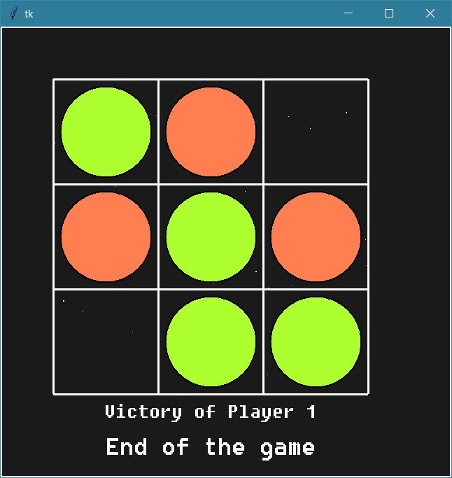

# Tic Tac Toe Game

Step by step creation of a Tic Tac Toe game using Tkinter library of Python. All the steps performed are detailed in the `.ipynb` file uploaded.

The final game can be found and run in the last chunk of code.

